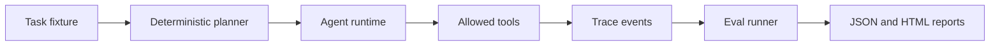

# AI Agent Production Lab

## Live Demo

- [Open the public GitHub Pages demo](https://kim3310.github.io/ai-agent-production-lab/)
- Scope: credential-free, synthetic-data demo for reviewers and evaluators.

Self-contained lab for agent runtime reliability, evaluation, tracing, and cost accounting. The lab uses a deterministic planner so the full workflow can be tested without external APIs or credentials.

## Product and Review Surface

A production-readiness lab for agents that makes planning, tracing, cost, and evaluation visible before real rollout.

| Lens | Definition |
|---|---|
| Audience | AI platform teams, backend teams, and product teams moving agents beyond demos. |
| Review path | Validate the demo, README, architecture notes, and quality gate before deeper workflow review. |
| Review signal | Deterministic planning fixtures, traces, cost accounting, eval assertions, and HTML reports. |
| Safety boundary | Lab fixtures are controlled; production rollouts need workflow-specific evals, rate limits, and approval paths. |
| Fast proof | Run the lab scripts and inspect generated HTML reports, traces, and eval assertions. |

## Reviewer Fast Path

- **First minute:** Read the trace/cost/eval loop before looking at individual tools.
- **Local demo:** Run `python3 scripts/run_demo.py` and open the generated HTML report under `artifacts/`.
- **Verification:** Run `python3 -m unittest discover -s tests` and `python3 -m agent_lab.evals examples/tasks.json`.

## Service Launch Playbook

- [Service launch playbook](docs/service-launch-playbook.md) maps the repository to review audiences, proof gates, operating boundaries, and risk controls.

## Review Notes

- [Review guide](docs/reviewer-evidence-map.md) summarizes the project angle, first files to inspect, verification commands, and known boundaries.
- [Quality notes](docs/quality-gate.md) lists the local checks, CI surface, and release expectations for this repository.
- [Enterprise readiness notes](docs/enterprise-readiness.md) outlines security, data, operations, integration, and handoff expectations.

## What It Demonstrates

- bounded tool execution
- deterministic traces
- eval cases with pass/fail assertions
- estimated token and cost accounting
- HTML and JSON report generation
- CI-friendly tests with no network dependency

## Architecture



## Quick Start

```bash
python3 -m unittest discover -s tests
python3 scripts/run_demo.py
```

The demo writes:

- `artifacts/agent-report.json`
- `artifacts/agent-report.html`

## Design Boundary

This repository does not try to simulate a full model provider. It isolates the production concerns around an agent loop: tool allowlisting, bounded execution, trace shape, evaluation scoring, and reproducible reports.

## Consolidated Patterns

- [Provider-neutral agent patterns](docs/provider-neutral-agent-patterns.md) folds scattered cookbook notes into a single runtime, eval, tracing, retrieval, and fallback checklist.

## Project Layout

```text
agent_lab/
  runtime.py   # runtime, tools, planner, trace events
  evals.py     # eval case loading and scoring
  report.py    # JSON and HTML report writer
examples/
  tasks.json   # deterministic eval cases
docs/
  provider-neutral-agent-patterns.md
scripts/
  run_demo.py  # local report generator
tests/
  test_runtime.py
```

## Verification

```bash
python3 -m unittest discover -s tests
python3 -m agent_lab.evals examples/tasks.json
```

All fixtures are synthetic.

## Cloud + AI Architecture

This repository includes a neutral cloud and AI engineering blueprint that maps the current proof surface to runtime boundaries, data contracts, model-risk controls, deployment posture, and validation hooks.

- [Cloud + AI architecture blueprint](docs/cloud-ai-architecture.md)
- [Machine-readable architecture manifest](docs/architecture/blueprint.json)
- Validation command: `python3 scripts/validate_architecture_blueprint.py`

## Enterprise Productization

- [Product operating model](docs/product-operating-model.md) defines the reviewer, trust boundary, trust boundary, operating checks, and service path for this repository.

## Service Architecture

- [Service architecture](docs/service-architecture.md) defines the cloud resources, account information, cost controls, and production guardrails needed to turn this repo into a scoped service without publishing public financial assumptions.
