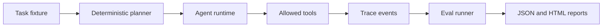

# AI Agent Production Lab

Self-contained lab for agent runtime reliability, evaluation, tracing, and cost accounting. The lab uses a deterministic planner so the full workflow can be tested without external APIs or credentials.

## What It Demonstrates

- bounded tool execution
- deterministic traces
- eval cases with pass/fail assertions
- estimated token and cost accounting
- HTML and JSON report generation
- CI-friendly tests with no network dependency

## Architecture



## Quick Start

```bash
python3 -m unittest discover -s tests
python3 scripts/run_demo.py
```

The demo writes:

- `artifacts/agent-report.json`
- `artifacts/agent-report.html`

## Design Boundary

This repository does not try to simulate a full model provider. It isolates the production concerns around an agent loop: tool allowlisting, bounded execution, trace shape, evaluation scoring, and reproducible reports.

## Project Layout

```text
agent_lab/
  runtime.py   # runtime, tools, planner, trace events
  evals.py     # eval case loading and scoring
  report.py    # JSON and HTML report writer
examples/
  tasks.json   # deterministic eval cases
scripts/
  run_demo.py  # local report generator
tests/
  test_runtime.py
```

## Verification

```bash
python3 -m unittest discover -s tests
python3 -m agent_lab.evals examples/tasks.json
```

All fixtures are synthetic.
