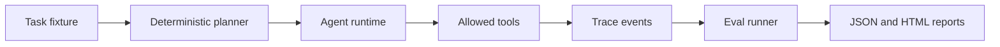

# AI Agent Production Lab

## Live Demo

- [Open the public Cloudflare Pages demo](https://ai-agent-production-lab.pages.dev/)
- Scope: credential-free, synthetic-data demo for product teams and technical evaluators.

Self-contained lab for agent runtime reliability, evaluation, tracing, and cost accounting. The lab uses a deterministic planner so the full workflow can be tested without external APIs or credentials.

## System Overview

A production-readiness lab for agents that makes planning, tracing, cost, and evaluation visible before real rollout.

| Area | Details |
|---|---|
| Users | AI platform teams, backend teams, and product teams moving agents beyond demos. |
| System scope | Deterministic planning fixtures, traces, cost accounting, eval assertions, and HTML reports. |
| Operating boundary | Lab fixtures are controlled; production rollouts need workflow-specific evals, rate limits, and approval paths. |
| Evaluation path | Run the lab scripts and inspect generated HTML reports, traces, and eval assertions. |

## Paid Service CTA

- Public demo boundary: credential-free, synthetic, deterministic proof surface; it does not inspect customer systems or certify production readiness by itself.
- Paid service: **Agent Reliability Audit** for private scenario review, trace review, failure taxonomy, provider scorecard, and prioritized remediation plan.
- Private inquiry: https://kim3310-doeon-kim-portfolio.pages.dev/?offer=ai-agent-production-lab&inquiry=agent-reliability-audit#private-inquiry

## Evaluation Path

- **Start here:** Read the trace/cost/eval loop before looking at individual tools.
- **Local demo:** Run `python3 scripts/run_demo.py` and open the generated HTML report under `artifacts/`.
- **Checks:** Run `python3 -m unittest discover -s tests` and `python3 -m agent_lab.evals examples/tasks.json`.

## Service Launch Playbook

- [Service launch playbook](docs/service-launch-playbook.md) maps the repository to its product scope, operating gates, operating boundaries, and risk controls.

## Architecture Notes

- [Architecture guide](docs/architecture-evidence-map.md) summarizes the system scope, first files to inspect, runtime commands, and known boundaries.
- [Quality notes](docs/quality-gate.md) lists the local checks, CI surface, and release expectations for this repository.
- [Enterprise readiness notes](docs/enterprise-readiness.md) outlines security, data, operations, integration, and handoff expectations.

## What It Demonstrates

- bounded tool execution
- deterministic traces
- eval cases with pass/fail assertions
- estimated token and cost accounting
- HTML and JSON report generation
- CI-friendly tests with no network dependency

## Architecture


```mermaid
flowchart LR
    Task["Task fixture"] --> Planner["Deterministic planner"]
    Planner --> Runtime["Agent runtime"]
    Runtime --> Tools["Allowed tools"]
    Tools --> Trace["Trace events"]
    Trace --> Eval["Eval runner"]
    Eval --> Report["JSON and HTML reports"]
```

## Quick Start

```bash
python3 -m unittest discover -s tests
python3 scripts/run_demo.py
```

The demo writes:

- `artifacts/agent-report.json`
- `artifacts/agent-report.html`

## Design Boundary

This repository does not try to simulate a full model provider. It isolates the production concerns around an agent loop: tool allowlisting, bounded execution, trace shape, evaluation scoring, and reproducible reports.

## Consolidated Patterns

- [Provider-neutral agent patterns](docs/provider-neutral-agent-patterns.md) folds scattered cookbook notes into a single runtime, eval, tracing, retrieval, and fallback checklist.

## Project Layout

```text
agent_lab/
  runtime.py   # runtime, tools, planner, trace events
  evals.py     # eval case loading and scoring
  report.py    # JSON and HTML report writer
examples/
  tasks.json   # deterministic eval cases
docs/
  provider-neutral-agent-patterns.md
scripts/
  run_demo.py  # local report generator
tests/
  test_runtime.py
```

## Verification

```bash
python3 -m unittest discover -s tests
python3 -m agent_lab.evals examples/tasks.json
```

All fixtures are synthetic.

## Cloud + AI Architecture

- [Cloud + AI architecture blueprint](docs/cloud-ai-architecture.md)
- [Machine-readable architecture manifest](docs/architecture/blueprint.json)
- Validation command: `python3 scripts/validate_architecture_blueprint.py`

## Enterprise Productization

- [Product operating model](docs/product-operating-model.md) defines the product scope, trust boundary, operating checks, and service path for this repository.

## System Architecture

- [System architecture](docs/system-architecture.md) maps the runtime boundary, data/control flow, cloud or local deployment surface, and operating assumptions for this repository.

## Service Architecture

- [Service architecture](docs/service-architecture.md) defines the cloud resources, account information, cost controls, and production guardrails needed to turn this repo into a scoped service without publishing public financial assumptions.

<!-- search-growth-readme:start -->

## Search And Service Surface

- Public entry: free production checklist and sample report
- Paid boundary: Agent Reliability Audit fixed-scope private audit from USD 1,500
- Canonical URL: https://ai-agent-production-lab.pages.dev/
- Lead capture: https://kim3310-doeon-kim-portfolio.pages.dev/?offer=ai-agent-production-lab&inquiry=agent-reliability-audit#private-inquiry
- Resource route: https://kim3310-doeon-kim-portfolio.pages.dev/resources/ai-agent-production-lab/
- Commercial route: https://kim3310-doeon-kim-portfolio.pages.dev/?offer=ai-agent-production-lab#service-offers
- Machine-readable offer: [docs/service-offer.json](docs/service-offer.json)
- Search growth implementation: [docs/search-growth-implementation.md](docs/search-growth-implementation.md)
- Revenue architecture: [docs/revenue-architecture.md](docs/revenue-architecture.md)

<!-- search-growth-readme:end -->

<!-- KIM3310:AD-DATA-PIVOT:START -->
## Free Resource, Advertising, and Aggregate Data

- [Public utility and architecture checklist](https://kim3310-doeon-kim-portfolio.pages.dev/resources/ai-agent-production-lab/)
- Revenue model: contextual advertising on the policy-eligible central resource page.
- Aggregate value: anonymous aggregate production-agent readiness gaps and CTA counts
- Boundary: ads allowed only on public launch-readiness pages; production-lab runs, logs, and dashboards are ad-free
- Consent defaults off, DNT/GPC fail closed, and personal or sensitive data is never sold.
<!-- KIM3310:AD-DATA-PIVOT:END -->
